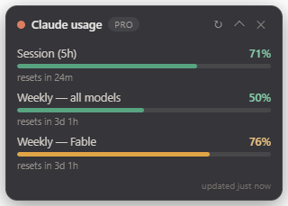

# Claude Usage Widget

A tiny always-on-top floating widget for **Windows and macOS** that shows your
Claude plan usage limits (session 5-hour window, weekly, and per-model weekly
caps) on top of whatever you're working on.



## Download

Grab the latest build from the
[**Releases page**](https://github.com/smafnan/claude-usage-widget/releases/latest):

| Platform | File |
|---|---|
| Windows — portable | `Claude-Usage-Portable-<version>.exe` (no install, just run) |
| Windows — installer | `Claude-Usage-Setup-<version>.exe` |
| macOS — Intel + Apple Silicon | `Claude-Usage-<version>-mac.dmg` |

**The builds are unsigned**, so the OS will warn on first launch:

- **Windows** SmartScreen: click *More info* → *Run anyway*.
- **macOS** Gatekeeper: after copying to Applications, run
  `xattr -cr "/Applications/Claude Usage.app"` once (or right-click the app →
  *Open*).

## Features

- Frameless, draggable card that stays above all windows (even fullscreen apps)
- Live progress bars for every limit Claude reports, colored by severity
  (green → amber → red), with "resets in…" countdowns
- **Built-in Claude sign-in** — no other tools required (and if you already use
  Claude Code, it picks up that sign-in automatically)
- Checks for fresh data every **10 seconds** (see *Refresh cadence* below)
- Collapsible to a slim one-line pill
- Tray icon: show/hide, refresh, start-at-login, quit
- Remembers its screen position

## Signing in

Two ways — whichever applies:

1. **You already use Claude Code** on this machine → nothing to do. The widget
   reuses Claude Code's sign-in automatically.
2. **Fresh machine** → click **Sign in with Claude** in the widget. Your
   browser opens claude.ai; sign in and authorize, copy the code shown on the
   final page, paste it into the widget, and hit *Complete sign-in*.

The sign-in uses the standard OAuth authorization-code + PKCE flow with
Claude's own client — the widget never sees your password, and tokens are
stored locally in Claude Code's own format/location
(`~/.claude/.credentials.json`, or the Keychain on macOS), so Claude Code and
the widget share one login.

## Refresh cadence

The widget polls every **10 seconds**, but Anthropic's usage endpoint
currently serves fresh data about **once per minute** per account and answers
HTTP 429 in between. The widget handles this gracefully: it keeps showing the
last good data (with an "updated Xs ago" stamp) and picks up fresh numbers at
the earliest moment the server allows.

## How it works

1. Reads Claude Code-format OAuth credentials
   - Windows/Linux: `~/.claude/.credentials.json`
   - macOS: Keychain item `Claude Code-credentials` (file fallback)
2. If the access token is expired, refreshes it against
   `https://console.anthropic.com/v1/oauth/token` and **writes the rotated
   token back**, so Claude Code keeps working normally.
3. Queries `https://api.anthropic.com/api/oauth/usage` — the same endpoint the
   `/usage` command in Claude Code uses — and renders the `limits` array.

> ⚠️ This endpoint is unofficial/undocumented and may change without notice.
> Tokens never leave your machine; the only network calls are to Anthropic
> (claude.ai / anthropic.com).

## Run from source

Requires Node.js 20+.

```sh
npm install
npm start
```

If `npm start` fails with "Electron failed to install correctly", run
`node node_modules/electron/install.js` once and retry.

## Package locally

```sh
npm run dist:win   # Windows portable .exe + installer (run on Windows)
npm run dist:mac   # macOS .dmg (must be run on a Mac)
```

Tagged pushes (`v*`) build both platforms on GitHub Actions and attach the
binaries to a GitHub Release automatically.

## macOS notes

- The first read/write of the Keychain item may prompt you to allow access —
  choose "Always Allow" so background polling works.
- The app hides its Dock icon and lives in the menu bar; the menu-bar item
  also shows the worst limit percentage.

## Troubleshooting

| Symptom | Fix |
|---|---|
| "No Claude sign-in found" | Click *Sign in with Claude* in the widget (or sign in to Claude Code) |
| "Session expired" | Click *Sign in with Claude* again — your refresh token was revoked |
| Widget vanished | Click the tray icon, or delete `widget-state.json` in the app's userData folder to reset its position |
| Numbers look stale | That's the server's ~1/min refresh allowance — see *Refresh cadence* |

## Dev

`WIDGET_CAPTURE=/path/to/out.png npm start` saves a PNG of the rendered widget
a few seconds after launch (used for screenshots/verification).
`CLAUDE_CREDENTIALS_PATH=/some/file npm start` overrides the credentials
location (useful for testing the signed-out state).
